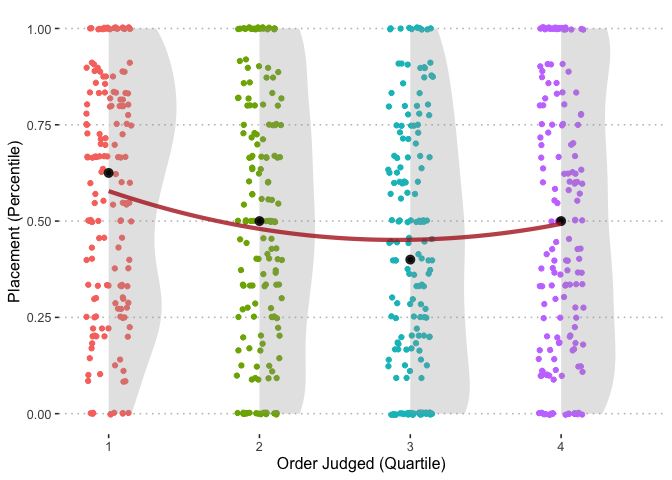

Primacy vs. Recency in the Great British Bake Off
================

## Question

Is it better to be first or last in the technical challenge of the Great
British Bake Off?

## Setup

The BBC television the *Great British Bake Off* (GBBO) is an amateur
baking competition that features a week-by-week elimination based on the
decisions of celebrity baker judges. Each week, there are three
challenges: a signature bake, a show-stopper, and a technical challenge.

During the technical challenge, the bakers are given identical
ingredients and imprecise directions. Upon completion, the bakers put
their creations behind their photos. The judges are then brought out to
judge the creations one by one, working from their right to left:

The technical challenge is the only one of the three weekly events that
features blind judging. Judges test the appearance, texture, and of
course, taste of each baker’s creation. We wondered if it was better to
be judged first (primacy effect), last (recency effect), or somewhere in
the middle (serial-position effect).

We hypothesized that being judged earlier would be better. Previous
tests of these effects focus on memory. But with GBBO, another factor
comes into play: hunger. Judges must eat a lot of baked goods,
especially in early weeks with more contestants. Perhaps the 12th bite
of a pastry – no matter how delicious – would not as satisfying as the
first, disadvantaging bakers judged earlier. Then again, maybe they have
forgotten how good that first bite was once they have had 11 more
tastes. The judges have mentioned this on several occasions:

## Results

#### Being judged early is good\!

Bakers judged in the first quartile consistently do the best. Depending
on the week, it’s a difference of *0.5-1* places (14 percent) better.

<!-- -->

To find this, we binned together the judging order into groups by week.
This is because there are a different number of contestants each week
(e.g. being judged 6th in week 1 is in the middle, but last by week 6).
More details on this below.

The effect of going early is more pronounced in the first 4 weeks of
each season, when being bakers judged early do by far the best. Going at
the end is also much worse when there are still many bakers remaining.
Later on, it’s worst to be in the middle.

<!-- -->

But bakers that see their creations judged later should not fret\! They
are no more likely to be sent home that week.

<!-- -->

This is true both early on and later in the competition, although going
first or last in the early weeks seems to be a bit better than going in
the middle.

<!-- -->

## Details and Statistics

Most tests of serial-position effects can simply compare the order
judged to the placement. With GBBO, there is a different number of
contestants each week, complicating the process of comparing the judging
order across weeks. Above, we simply break into quartiles and drop the
final, when there are only 3 contestants. An alternative approach is to
break into n-tiles that only include at least n contestants.

<!-- -->

This reveals a fairly similar pattern throughout: going early is better.
We can also look only by week:

<!-- -->

### Regressions

Regressions to go with the figures above measured the change in the
order judged bin on the placement percentile (within week). Fixed
effects for week, season, and whether the bake was sweet or savory were
also included.

<table class="table" style="width: auto !important; margin-left: auto; margin-right: auto;">

<caption>

Order Judged Quartile and Placement Percentile

</caption>

<thead>

<tr>

<th style="text-align:left;">

term

</th>

<th style="text-align:right;">

estimate

</th>

<th style="text-align:right;">

std.error

</th>

<th style="text-align:right;">

statistic

</th>

<th style="text-align:right;">

p.value

</th>

<th style="text-align:right;">

conf.low

</th>

<th style="text-align:right;">

conf.high

</th>

<th style="text-align:right;">

df

</th>

</tr>

</thead>

<tbody>

<tr>

<td style="text-align:left;">

(Intercept)

</td>

<td style="text-align:right;">

0.580

</td>

<td style="text-align:right;">

0.067

</td>

<td style="text-align:right;">

8.712

</td>

<td style="text-align:right;">

0.000

</td>

<td style="text-align:right;">

0.450

</td>

<td style="text-align:right;">

0.711

</td>

<td style="text-align:right;">

633

</td>

</tr>

<tr>

<td style="text-align:left;">

as.factor(bins)2

</td>

<td style="text-align:right;">

\-0.065

</td>

<td style="text-align:right;">

0.036

</td>

<td style="text-align:right;">

\-1.811

</td>

<td style="text-align:right;">

0.071

</td>

<td style="text-align:right;">

\-0.135

</td>

<td style="text-align:right;">

0.005

</td>

<td style="text-align:right;">

633

</td>

</tr>

<tr>

<td style="text-align:left;">

as.factor(bins)3

</td>

<td style="text-align:right;">

\-0.141

</td>

<td style="text-align:right;">

0.035

</td>

<td style="text-align:right;">

\-3.978

</td>

<td style="text-align:right;">

0.000

</td>

<td style="text-align:right;">

\-0.210

</td>

<td style="text-align:right;">

\-0.071

</td>

<td style="text-align:right;">

633

</td>

</tr>

<tr>

<td style="text-align:left;">

as.factor(bins)4

</td>

<td style="text-align:right;">

\-0.068

</td>

<td style="text-align:right;">

0.037

</td>

<td style="text-align:right;">

\-1.848

</td>

<td style="text-align:right;">

0.065

</td>

<td style="text-align:right;">

\-0.140

</td>

<td style="text-align:right;">

0.004

</td>

<td style="text-align:right;">

633

</td>

</tr>

</tbody>

</table>

<table class="table" style="width: auto !important; margin-left: auto; margin-right: auto;">

<caption>

Order Judged Quartile and Likelihood of Leaving the Tent

</caption>

<thead>

<tr>

<th style="text-align:left;">

term

</th>

<th style="text-align:right;">

estimate

</th>

<th style="text-align:right;">

std.error

</th>

<th style="text-align:right;">

statistic

</th>

<th style="text-align:right;">

p.value

</th>

<th style="text-align:right;">

conf.low

</th>

<th style="text-align:right;">

conf.high

</th>

<th style="text-align:right;">

df

</th>

</tr>

</thead>

<tbody>

<tr>

<td style="text-align:left;">

(Intercept)

</td>

<td style="text-align:right;">

0.0304

</td>

<td style="text-align:right;">

0.0634

</td>

<td style="text-align:right;">

0.4795

</td>

<td style="text-align:right;">

0.6318

</td>

<td style="text-align:right;">

\-0.0941

</td>

<td style="text-align:right;">

0.1549

</td>

<td style="text-align:right;">

633

</td>

</tr>

<tr>

<td style="text-align:left;">

as.factor(bins)2

</td>

<td style="text-align:right;">

0.0356

</td>

<td style="text-align:right;">

0.0374

</td>

<td style="text-align:right;">

0.9516

</td>

<td style="text-align:right;">

0.3417

</td>

<td style="text-align:right;">

\-0.0379

</td>

<td style="text-align:right;">

0.1091

</td>

<td style="text-align:right;">

633

</td>

</tr>

<tr>

<td style="text-align:left;">

as.factor(bins)3

</td>

<td style="text-align:right;">

0.0416

</td>

<td style="text-align:right;">

0.0370

</td>

<td style="text-align:right;">

1.1244

</td>

<td style="text-align:right;">

0.2613

</td>

<td style="text-align:right;">

\-0.0311

</td>

<td style="text-align:right;">

0.1144

</td>

<td style="text-align:right;">

633

</td>

</tr>

<tr>

<td style="text-align:left;">

as.factor(bins)4

</td>

<td style="text-align:right;">

0.0049

</td>

<td style="text-align:right;">

0.0353

</td>

<td style="text-align:right;">

0.1396

</td>

<td style="text-align:right;">

0.8890

</td>

<td style="text-align:right;">

\-0.0644

</td>

<td style="text-align:right;">

0.0742

</td>

<td style="text-align:right;">

633

</td>

</tr>

</tbody>

</table>
