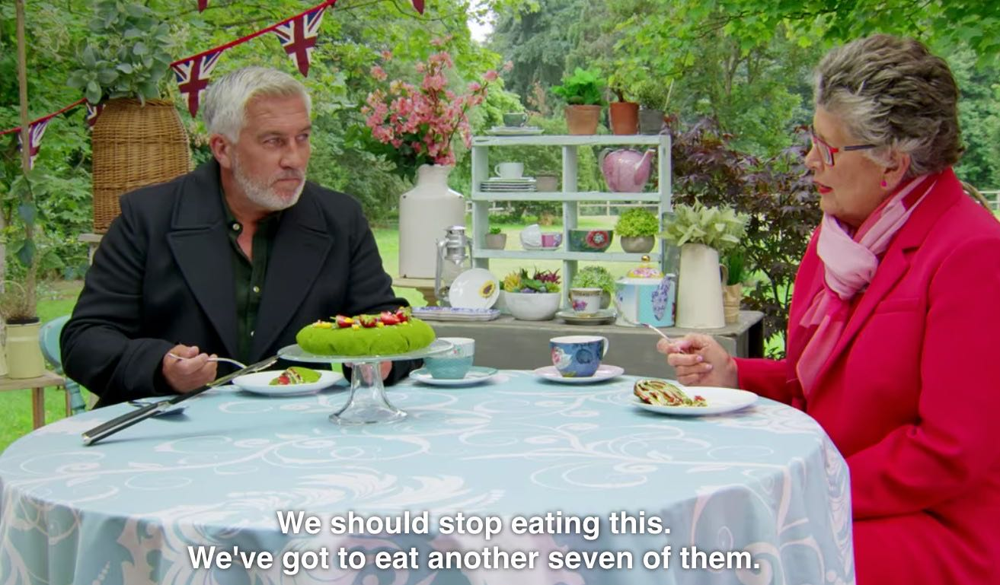

```{r setup, echo=FALSE, include=FALSE}
knitr::opts_knit$set(root.dir = rprojroot::find_rstudio_root_file())
knitr::opts_chunk$set(message = FALSE, warning = FALSE, echo=F)
library(knitr)
library(kableExtra)
library(tidyverse)
library(broom)
library(estimatr)
library(ggpubr)
library(ggdist)


```

``` {r setup2, echo =F}
working <- read_csv("Data/working.csv") %>% 
  mutate(num_bins = case_when(
    week == 1 ~ 12,
    week == 2 ~ 11,
    week == 3 ~ 10,
    week == 4 ~ 9,
    week == 5 ~ 8,
    week == 6 ~ 7,
    week == 7 ~ 6,
    week == 8 ~ 5,
    week == 9 ~ 4,
    week == 10 ~ 3,
    is.na(week) ~ 4
  ))

allweeks <- as.list(unique(working$week))

test <- lapply(allweeks, function(x){
  temp <- working %>% 
    filter(!is.na(week)) %>% 
    filter(week <= x) 
  
  temp %>% 
    mutate(bins = ntile(x = order_judged_std, n=min(num_bins))) %>% 
    filter(!is.na(bins)) %>% 
    group_by(bins) %>%
    # summarise(placement = mean(placement_std, na.rm=T)) %>% 
    ggplot(., aes(x = bins, y = placement_prank, colour = as.factor(bins))) + geom_jitter(width = .15) +
    # scale_color_brewer(palette="Set1") +
    stat_halfeye(show.legend = F, width = .5, point_colour = "black", interval_alpha = 0, slab_alpha = .3,
                 point_alpha = .8) +
    xlab("Order Judged (Quartile)") +
    ylab("Placement (Percentile)") + 
    stat_smooth(geom = 'line', method = "lm", formula = y ~ x + I(x^2), se = F, colour = "firebrick", alpha = 0.8, size = 1.5) + 
    theme_pubclean() +
    theme(legend.position = "none") 
  
})

out <- lapply(allweeks, function(x){
  temp <- working %>% 
    filter(!is.na(week)) %>% 
    filter(week <= x) 
  
  temp %>% 
    mutate(bins = ntile(x = order_judged_std, n=min(num_bins))) %>% 
    filter(!is.na(bins)) %>% 
    group_by(bins) %>%
    summarise(placement = mean(week_out2, na.rm=T), placement_sd = sd(week_out2, na.rm=T), n=n())%>%
    mutate(placement_se = placement_sd/sqrt(n)) %>% 
    ggplot(., aes(x = bins, y = placement, colour = as.factor(bins))) + geom_point() +
    geom_errorbar(aes(ymin = placement - 1.96*placement_se, ymax = placement + 1.96*placement_se)) +
    stat_halfeye(show.legend = F, width = .5, point_colour = "black", interval_alpha = 0, slab_alpha = .3,
                 point_alpha = .8) +
    xlab("Order Judged (Quartile)") +
    ylab("Probability of Leaving the Tent") + 
    stat_smooth(geom = 'line', se = F, method = "lm", formula = y ~ x + I(x^2), colour = "firebrick", alpha = 0.8, size = 1.5) + 
    theme_pubclean() +
    theme(legend.position = "none") 
  
})

```


## Question

Is it better to be first or last in the technical challenge of the Great British Bake Off?

## Setup

The BBC television the *Great British Bake Off* (GBBO) is an amateur baking competition that features a week-by-week elimination based on the decisions of celebrity baker judges. Each week, there are three challenges: a signature bake, a show-stopper, and a technical challenge.

During the technical challenge, the bakers are given identical ingredients and imprecise directions. Upon completion, the bakers put their creations behind their photos. The judges are then brought out to judge the creations one by one, working from their right to left:


The technical challenge is the only one of the three weekly events that features blind judging. Judges test the appearance, texture, and of course, taste of each baker's creation. We wondered if it was better to be judged first (primacy effect), last (recency effect), or somewhere in the middle (serial-position effect). 

We hypothesized that being judged earlier would be better. Previous tests of these effects focus on memory. But with GBBO, another factor comes into play: hunger. Judges must eat a lot of baked goods, especially in early weeks with more contestants. Perhaps the 12th bite of a pastry -- no matter how delicious -- would not as satisfying as the first, disadvantaging bakers judged earlier. Then again, maybe they have forgotten how good that first bite was once they have had 11 more tastes. The judges have mentioned this on several occasions:

```{r echo=FALSE, out.width='60%'}

```


## Results 

#### Being judged early is good!

Bakers judged in the first quartile consistently do the best. Depending on the week, it's a difference of *0.5-1* places (14 percent) better. 

```{r, results=FALSE}
test[9]
```

To find this, we binned together the judging order into groups by week. This is because there are a different number of contestants each week (e.g. being judged 6th in week 1 is in the middle, but last by week 6). More details on this below. 

The effect of going early is more pronounced in the first 4 weeks of each season, when being bakers judged early do by far the best. Going at the end is also much worse when there are still many bakers remaining. Later on, it's worst to be in the middle. 

```{r}

working_reg <- working %>% 
  mutate(bins = ntile(x = order_judged_std, n=4))

temp1 <- working_reg %>% 
  filter(!is.na(week)) %>% 
  filter(week <= 9 & week >=5) 
temp2 <- working_reg %>% 
  filter(!is.na(week)) %>% 
  filter(week <= 4)

late <- temp1 %>% 
  mutate(bins = ntile(x = order_judged_std, n=4)) %>% 
  filter(!is.na(bins)) %>% 
  group_by(bins) %>%
  # summarise(placement = mean(placement_std, na.rm=T)) %>% 
  ggplot(., aes(x = bins, y = placement_prank, colour = as.factor(bins))) + geom_jitter(width = .15) +
  # scale_color_brewer(palette="Set1") +
  stat_halfeye(show.legend = F, width = .5, point_colour = "black", interval_alpha = 0, slab_alpha = .3,
               point_alpha = .8) +
  xlab("Order Judged (Quartile) \n Weeks 5-9") +
  ylab("Placement (Percentile)") + 
  stat_smooth(geom = 'line', method = "lm", formula = y ~ x + I(x^2), se = F, colour = "firebrick", alpha = 0.8, size = 1.5) + 
  theme_pubclean() +
  theme(legend.position = "none") 

early <- temp2 %>% 
  mutate(bins = ntile(x = order_judged_std, n=4)) %>% 
  filter(!is.na(bins)) %>% 
  group_by(bins) %>%
  # summarise(placement = mean(placement_std, na.rm=T)) %>% 
  ggplot(., aes(x = bins, y = placement_prank, colour = as.factor(bins))) + geom_jitter(width = .15) +
  # scale_color_brewer(palette="Set1") +
  stat_halfeye(show.legend = F, width = .5, point_colour = "black", interval_alpha = 0, slab_alpha = .3,
               point_alpha = .8) +
  xlab("Order Judged (Quartile)  \n Weeks 1-4") +
  ylab("Placement (Percentile)") + 
  stat_smooth(geom = 'line', method = "lm", formula = y ~ x + I(x^2), se = F, colour = "firebrick", alpha = 0.8, size = 1.5) + 
  theme_pubclean() +
  theme(legend.position = "none") 
ggarrange(early, late)
```

But bakers that see their creations judged later should not fret! They are no more likely to be sent home that week.

```{r}
out[[9]]
```

This is true both early on and later in the competition, although going first or last in the early weeks seems to be a bit better than going in the middle. 

```{r}
late2 <- temp1 %>% 
  mutate(bins = ntile(x = order_judged_std, n=4)) %>% 
  filter(!is.na(bins)) %>% 
  group_by(bins) %>%
  summarise(placement = mean(week_out2, na.rm=T), placement_sd = sd(week_out2, na.rm=T), n=n())%>%
  mutate(placement_se = placement_sd/sqrt(n)) %>% 
  ggplot(., aes(x = bins, y = placement, colour = as.factor(bins))) + geom_point() +
  geom_errorbar(aes(ymin = placement - 1.96*placement_se, ymax = placement + 1.96*placement_se)) +
  # scale_color_brewer(palette="Set1") +
  stat_halfeye(show.legend = F, width = .5, point_colour = "black", interval_alpha = 0, slab_alpha = .3,
               point_alpha = .8) +
  xlab("Order Judged (Quartile) \n Weeks 5-9") +
  ylab("Probability of Leaving the Tent") + 
  stat_smooth(geom = 'line', method = "lm", formula = y ~ x + I(x^2), se = F, colour = "firebrick", alpha = 0.8, size = 1.5) + 
  theme_pubclean() +
  theme(legend.position = "none") 

early2 <- temp2 %>% 
  mutate(bins = ntile(x = order_judged_std, n=4)) %>% 
  filter(!is.na(bins)) %>% 
  group_by(bins) %>%
  summarise(placement = mean(week_out2, na.rm=T), placement_sd = sd(week_out2, na.rm=T), n=n())%>%
  mutate(placement_se = placement_sd/sqrt(n)) %>% 
  ggplot(., aes(x = bins, y = placement, colour = as.factor(bins))) + geom_point() +
  geom_errorbar(aes(ymin = placement - 1.96*placement_se, ymax = placement + 1.96*placement_se)) +
  # scale_color_brewer(palette="Set1") +
  stat_halfeye(show.legend = F, width = .5, point_colour = "black", interval_alpha = 0, slab_alpha = .3,
               point_alpha = .8) +
  xlab("Order Judged (Quartile)  \n Weeks 1-4") +
  ylab("Probability of Leaving the Tent") + 
  stat_smooth(geom = 'line', method = "lm", formula = y ~ x + I(x^2), se = F, colour = "firebrick", alpha = 0.8, size = 1.5) + 
  theme_pubclean() +
  theme(legend.position = "none") 
ggarrange(early2, late2)
```


## Details and Statistics

Most tests of serial-position effects can simply compare the order judged to the placement. With GBBO, there is a different number of contestants each week, complicating the process of comparing the judging order across weeks. Above, we simply break into quartiles and drop the final, when there are only 3 contestants. An alternative approach is to break into n-tiles that only include at least n contestants. 

```{r}
allweeks <- as.list(unique(working$week))

test <- lapply(allweeks, function(x){
  temp <- working %>% 
    filter(!is.na(week)) %>% 
    filter(week <= x) 
  
  temp %>% 
    mutate(bins = ntile(x = order_judged_std, n=min(num_bins))) %>% 
    filter(!is.na(bins)) %>% 
    group_by(bins) %>%
    # summarise(placement = mean(placement_std, na.rm=T)) %>% 
    ggplot(., aes(x = bins, y = placement_prank, colour = as.factor(bins))) + geom_jitter(width = .15) +
    # scale_color_brewer(palette="Set1") +
    stat_halfeye(show.legend = F, width = .5, point_colour = "black", interval_alpha = 0, slab_alpha = .3,
                 point_alpha = .8) +
    xlab("Order Judged (Bin)") +
    ylab("Placement (Percentile)") + 
    stat_smooth(geom = 'line', method = "lm", formula = y ~ x + I(x^2), se = F, colour = "firebrick", alpha = 0.8, size = 1.5) + 
    theme_pubclean() +
    theme(legend.position = "none") 
  
})

ggarrange(plotlist = test)
```

This reveals a fairly similar pattern throughout: going early is better. We can also look only by week:

```{r}
test <- lapply(allweeks, function(x){
  temp <- working %>% 
    filter(!is.na(week)) %>% 
    filter(week == x) 
  
  temp %>% 
    mutate(bins = ntile(x = order_judged_std, n=min(num_bins))) %>% 
    filter(!is.na(bins)) %>% 
    group_by(bins) %>%
    # summarise(placement = mean(placement_std, na.rm=T)) %>% 
    ggplot(., aes(x = bins, y = placement_prank, colour = as.factor(bins))) + geom_jitter(width = .15) +
    # scale_color_brewer(palette="Set1") +
    stat_halfeye(show.legend = F, width = .5, point_colour = "black", interval_alpha = 0, slab_alpha = .3,
                 point_alpha = .8) +
    xlab("Order Judged (Bin)") +
    ylab("Placement (Percentile)") + 
    stat_smooth(geom = 'line', method = "lm", formula = y ~ x + I(x^2), se = F, colour = "firebrick", alpha = 0.8, size = 1.5) + 
    theme_pubclean() +
    theme(legend.position = "none") 
  
})

ggarrange(plotlist = test)
```

### Regressions 

Regressions to go with the figures above measured the change in the order judged bin on the placement percentile (within week). Fixed effects for week, season, and whether the bake was sweet or savory were also included. 

```{r}
tidy(lm_robust(placement_prank ~ as.factor(bins)  + as.factor(week) + as.factor(season) + as.factor(sweet), data = working_reg %>% 
            filter(week!=10))) %>% filter(grepl("bins", term)| grepl("Intercept", term)) %>% dplyr::select(-outcome) %>% kbl(caption = "Order Judged Quartile and Placement Percentile", digits = 3) %>%
  kable_styling(full_width = F)

```

```{r}

tidy(lm_robust(week_out2 ~ as.factor(bins)  + as.factor(week) + as.factor(season) + as.factor(sweet), data = working_reg %>% 
            filter(week!=10))) %>% filter(grepl("bins", term)| grepl("Intercept", term)) %>% dplyr::select(-outcome) %>% kbl(caption = "Order Judged Quartile and Likelihood of Leaving the Tent", digits =4) %>%
  kable_styling(full_width = F)

```

